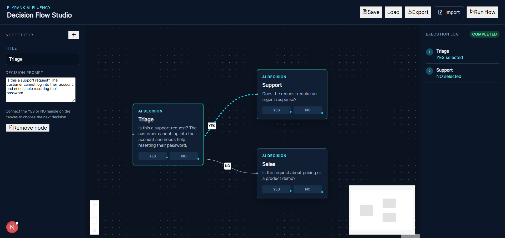
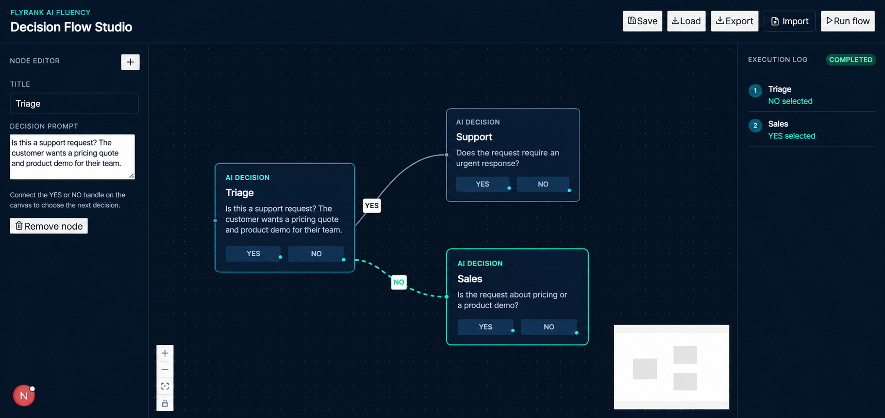

# Decision Flow Studio

A visual AI workflow editor for branching YES/NO decisions. The frontend uses React Flow to create and connect nodes; Inngest executes every node as a durable step; Gemini supplies the decision by default and must return exactly `YES` or `NO`.

## Features

- React Flow canvas with editable decision nodes and dedicated YES/NO source handles
- Local workflow state, browser save/load, and JSON import/export
- Inngest-backed execution with one durable step per node
- Strict Gemini or OpenAI decision parsing, retries, visible errors, and loop protection
- Execution log, active-node styling, and animated active edges

## Setup

```bash
npm install
cp .env.example .env.local
npm run dev
```

In a second terminal, start the Inngest development server:

```bash
npm run inngest
```

Open `http://localhost:3000`, add your `GEMINI_API_KEY` (or optional `OPENAI_API_KEY`) to `.env.local`, and run a flow. The Inngest dev UI will connect to `http://localhost:3000/api/inngest`.

## Workflow behavior

Each node submits its prompt to the model with a constrained instruction to answer `YES` or `NO`. The matching YES or NO edge determines the next node. A path ends when the selected outcome has no outgoing edge. Cycles are rejected during execution.

## Project structure

```text
src/app/                     Next.js UI and API routes
src/components/              React Flow node and Shadcn-style UI components
src/inngest/                 Client and durable workflow function
src/lib/                     Shared graph helpers and development run state
```

The run-state store is deliberately a local ignored JSON file for development. Replace it with a durable database before deploying to a serverless production environment.

## Live Gemini verification

Verified locally on 2026-09-09 with Gemini `gemini-3.6-flash`, the Next.js app, and the local Inngest development server. The workflow run state is stored in an ignored local JSON ledger during development so the execution route and polling route share the same status.

| Run | Prompt summary | Observed result |
| --- | --- | --- |
| `9bec7d16-d9be-4ad4-8a64-9058c9ef1143` | Login/password-reset support request | Completed with `YES` at the Support triage node |
| `06476d19-fd11-4d7c-a608-acac21603378` | Pricing quote and product-demo request | Completed with `NO` at the Sales triage node |

The provider initially rejected the retired `gemini-2.0-flash` model. The project now defaults to `gemini-3.6-flash`; the response budget is 64 tokens to leave room for the model's internal reasoning while the application still accepts only an exact `YES` or `NO` decision.

For visual submission evidence, open the local app, run the two prompts above, and capture the completed execution log for each path. Keep credentials out of screenshots.




